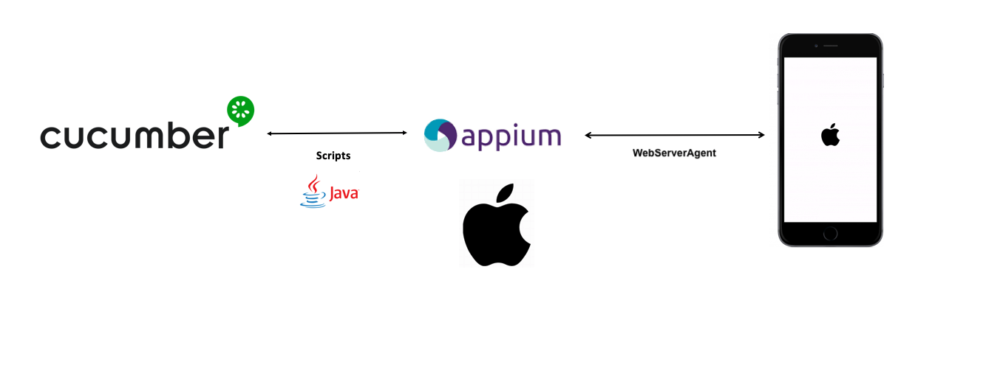

Scenarios contained in feature files written in Gherkin language.
Available scenarios can be found
[here](ios-scenario-testing/src/test/resources/io/cucumber).

Defined for the [ownCloud iOS app](https://github.com/owncloud/ios)


## Global overview

- Scenarios are defined with [Gherkin
Syntax](https://cucumber.io/docs/gherkin/).

- Steps are interpreted by [Cucumber](https://cucumber.io/).

- Step implementation language:
[Java](https://docs.oracle.com/javase/7/docs/)

- Device interaction with [Appium](http://appium.io/)

- Reports generated with [Cucumber Reports](https://reports.cucumber.io/)



## Get the code

- With git:

`git clone https://github.com/owncloud/ios-scenario-testing.git`

- Download a [zip
file](https://github.com/owncloud/ios-scenario-testing/archive/master.zip)


## Requirements

Different requirements:

* `Appium` instance running and reachable. Last Appium review: v2.11.2

* At least, one iOS simulator attached and reachable.

* The following libraries and dependencies to be installed:

	* `authorize-ios`: A little utility that pre-authorizes Instruments to run UIAutomation scripts against iOS devices
	* `ios-deploy` : Allows install and debug iOS apps from the command line
	* `ideviceinstaller`: A command-line application to manage apps on iOS devices
	* `ios-webkit-debug-proxy`: Allows to send commands to MobileSafari and UIWebViews
	* `ios-sim` : Simulator manager (start, launch...)

## How to test

### 1. Build app

First, build the [app](https://github.com/owncloud/ios-app) from the expected branch/commit to get the test object. Before building, execute the following commands in the app's folder:

```
gsed -i 's/.showBetaWarning : true/.showBetaWarning : false/i' ownCloudAppShared/Tools/VendorServices.swift
grep .showBetaWarning ownCloudAppShared/Tools/VendorServices.swift
gsed -i '170,200d' ownCloud/Release\ Notes/ReleaseNotesHostViewController.swift
grep -C 2 shouldShowReleaseNotes ownCloud/Release\ Notes/ReleaseNotesHostViewController.swift
gsed -i '136i OCConnectionAllowedAuthenticationMethodIDs : @[ OCAuthenticationMethodIdentifierBasicAuth ],' ios-sdk/ownCloudSDK/Connection/OCConnection.m
```
These instructions:

- will disable the beta warning
- will disable the release notes
- will set basic auth as forced authentication method, required to execute the test suites

App is built via Xcode or CLI (`xcodebuild`)

After building, the `ownCloud.app` artifact is located in:

`$HOME/Library/Developer/Xcode/DerivedData/ownCloud-*/Build/Products/Debug-*`

move the `owncloud.app` to the correct place in the current tests project: `/src/test/resources`

(in the current repository will be always an `owncloud.app` file located in the correct place.)

### 2. Execute tests

The script `executeTests` will launch the tests. The following environment variables must be set in advance

		$OC_SERVER_URL (mandatory): URL of ownCloud server to test against
		$UDID_DEVICE (optional): UDID of the device to execute the tests against.
			To get the UDID of available simulators, use the  command `xcrun simctl list`
		$APPIUM_URL (optional): Appium server URL.
			If Appium Server is not specified, will be used "localhost:4723/wd/hub"

The script needs some parameters. Check help `executeTests -h`

To execute all tests but the ignored ones (or any other tagged ones):

	export UDID_DEVICE=F10FFCD4-CE92-4F40-B246-9709A4D4086A
	export OC_SERVER_URL=https://my.owncloud.server
	export APPIUM_URL=localhost:4723
	./executeTests -t "not @ignore"

The execution will display step by step how the scenario is being executed.

More info in [Cucumber reference](https://cucumber.io/docs/cucumber/api/)

**NOTE**: Since there are two kinds of backends available (oC10, oCIS), not all tests are suitable to be executed over both. Those tests have been tagged with:

- `nooc10`: tests to be executed only over oCIS, not suitable for oC10.
- `noocis`: tests to be executed only over oC10, not suitable for oCIS.

It's important to execute the tests with the mentioned tags to avoid wrong positives. Example commands:

`./executeTests -t "not @ignore and not @noocis"`<br>
This command will execute tests that are not ignored and suitable for oCIS. If this command is run over an oC10 instance, some tests will fail.

`./executeTests -t "not @ignore and not @nooc10"`<br>
This command will execute tests that are not ignored and suitable for oC10. If this command is run over an oCIS instance, some tests will fail.


## Results

In the folder `target`, you will find a report with the execution results in html and json formats.

Besides of that, by setting the `cucumber.properties` file allow to integrate reports with [Cucumber reports](https://cucumber.io/docs/cucumber/reporting/?lang=java). An account in such platform (integrated with GitHub) is enough to use it. A new env variable must be set in advance in order to send reports to the platform. Token is provided in the Cucumber Reports account for every collection:

	export CUCUMBER_PUBLISH_TOKEN=d97...

Also, in `cucumber.properties` file with the following values (disabled by default):

	cucumber.publish.quiet=false
	cucumber.publish.enabled=true

**Note**: This repository was forked from [Cucumber-java
skeleton](https://github.com/cucumber/cucumber-java-skeleton)
repository, which contains the base skeleton to start working.

## Versioning

Up to date: 02/Aug/2024

|||
|:-- |:-: |
| [Cucumber version](https://cucumber.io/docs/installation/java/) | 7.18.0 |
| [Appium version](https://github.com/appium/appium/releases)| 2.11.2|
| [Appium xcuitest driver version](https://github.com/appium/appium-xcuitest-driver/releases)| 5.16.1|
| [Java client version](https://github.com/appium/java-client/releases) | 9.2.2 |
